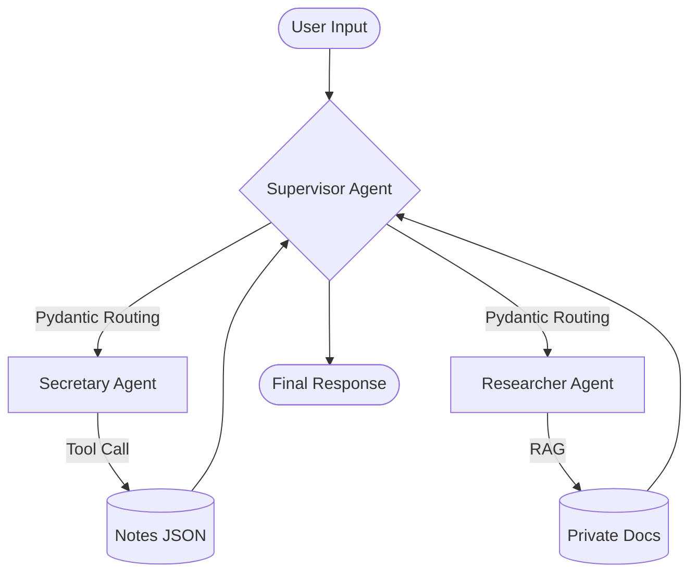

# Kaia — Multi-Agent AI Assistant

Kaia is a production-grade autonomous companion built with **Python**, **LangGraph**, and **Gemini 1.5/2.5 Flash**. Unlike standard chatbots, Kaia utilizes a **Multi-Agent Star Topology** to orchestrate specialized tasks—ranging from personal administration to deep technical research.

---

## 🚀 Core Features

- **Multi-Agent Orchestration** — Uses a central **Supervisor** node to delegate tasks to specialized agents (Secretary, Researcher, etc.) in a Hub-and-Spoke model.
- **Structured Output (Pydantic)** — Robust routing logic enforced via Pydantic schemas to ensure zero-hallucination agent delegation and reliable state transitions.
- **Hybrid Memory System** — Combines session-based chat history with extraction-based long-term memory (`[REMEMBER]` protocol) and **RAG** for technical documentation.
- **Production Observability** — Deep integration with **LangSmith** for full-cycle tracing, debugging, and chain performance evaluation.
- **State Integrity Protocol** — Intelligent handling of "Write-before-Read" operations to prevent race conditions during multi-intent queries.

---

## 🏗️ Architecture: The Star Topology

Kaia operates on a **Star Topology** where a central Orchestrator (Supervisor) manages the state and coordinates specialized workers. This ensures modularity and scalability.



## Technical Stack:
- Orchestration: LangGraph (Stateful, Multi-Agent)
- Model: Gemini 2.5 Flash (via LangChain Google GenAI)
- Data Validation: Pydantic (Structured Output)
- Monitoring: LangSmith
- Storage: JSON (Memory/Notes) + Vector DB (RAG)

## Project Structure

```
kaia-assistant/
├── src/
│   ├── agent/
│   │   ├── workers/         # Specialized agent nodes (Secretary, Researcher)
│   │   ├── prompts.py       # Centralized system prompts & worker identities
│   │   ├── state.py         # LangGraph State definition (TypedDict)
│   │   └── graph.py         # Star Topology Graph & Pydantic Routing logic
│   ├── tools/
│   │   ├── __init__.py      # Central tool registry
│   │   ├── secretary_tools.py # Admin tools (Notes, Datetime)
│   │   └── rag_tool.py      # RAG & Document retrieval tools
├── data/
│   ├── memory.json          # Persisted extraction-based memory
│   └── notes.json           # Managed personal notes
├── main.py                  # Entry point (Chat loop + Memory extraction)
└── requirements.txt
```


## 🛠️ Specialized Agents & Toolsets

1. Supervisor (The Orchestrator)
The "Central Brain" of the system. It uses Structured Output to analyze user intent and decide whether to call a specialist or provide a final synthesis. It acts as a transaction manager to ensure all sub-tasks are completed before finishing.

2. Secretary (The Admin)
Handles personal state management and scheduling.

- get_current_datetime: Provides contextual time awareness for relative queries.

- save_note / get_notes / delete_note: Full CRUD operations for personal administrative data.

3. Researcher (The Knowledge Specialist)
Executes RAG (Retrieval Augmented Generation) to answer questions based on private documents, such as CVs, project technical specs, and engineering logs.

## 🧠 Memory Systems
Short-term: Managed via a sliding-window chat_history within the LangGraph state.

Long-term: An extraction-based system that parses [REMEMBER: fact] tags from AI responses. These facts are persisted in memory.json and injected into the Supervisor's context during initialization.

## 📈 Roadmap
- [x] Multi-Agent Star Topology implementation
- [x] Pydantic Structured Output for routing
- [x] LangSmith observability integration
- [ ] GitHub MCP Integration (Active Development)
- [ ] Google Calendar MCP Integration (Planned)
- [ ] Web Search Tool (News Agent)
- [ ] Streamlit/Next.js Web Interface
